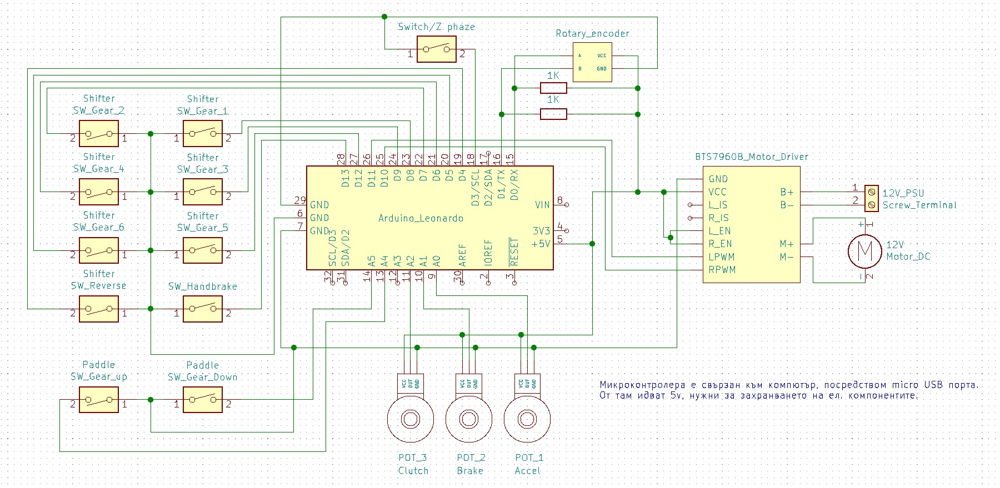
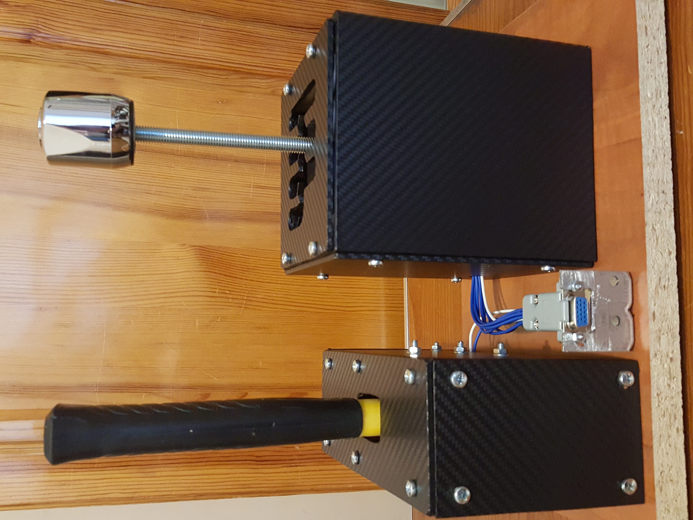
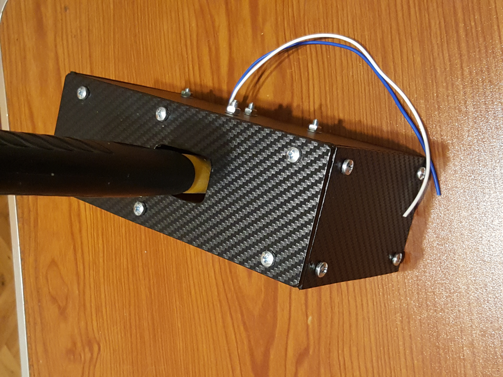
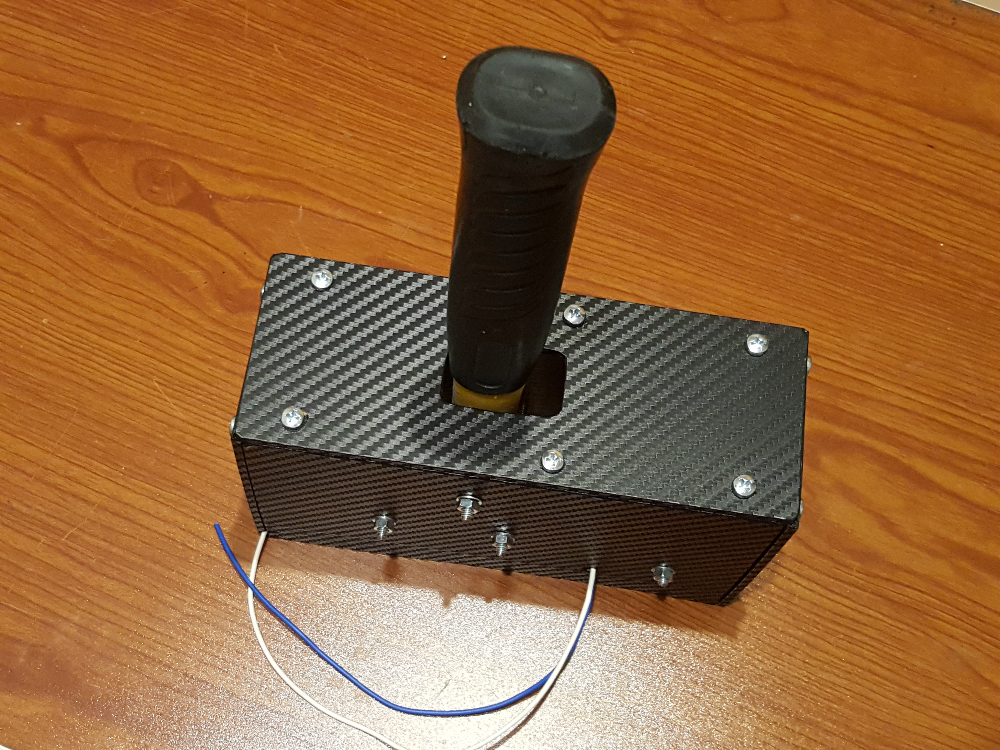
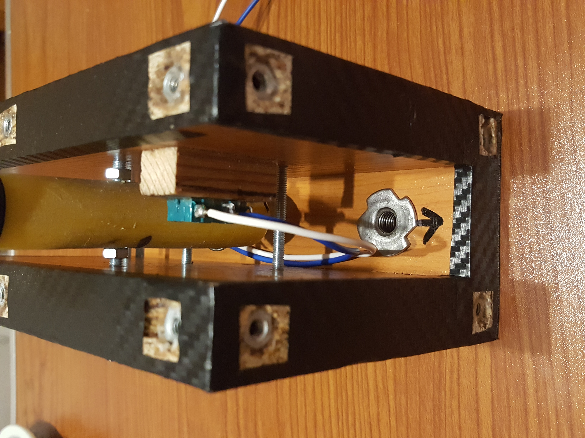
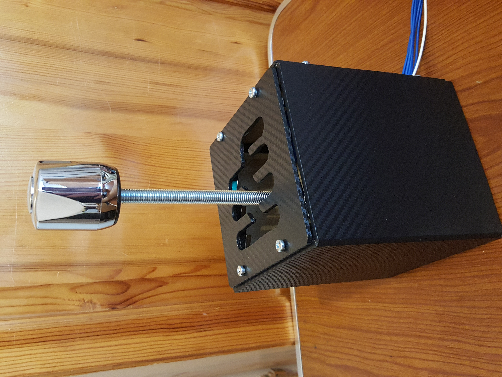
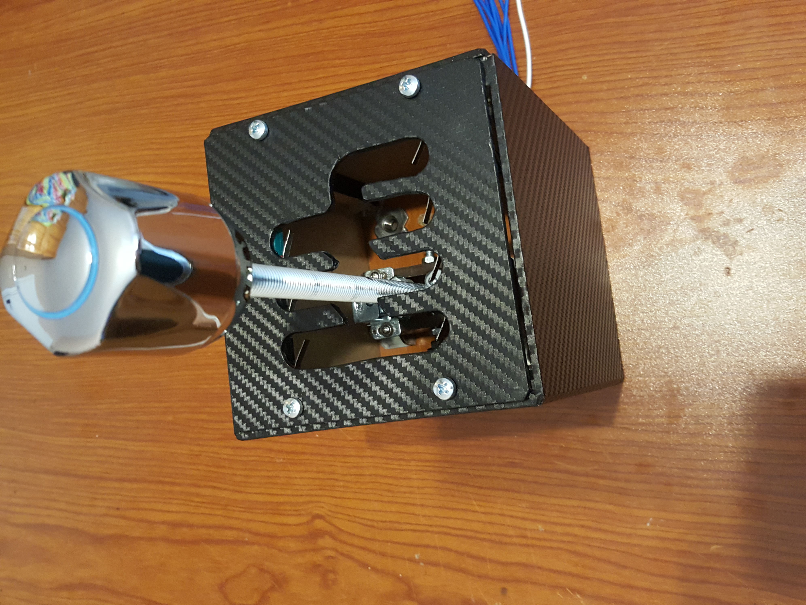
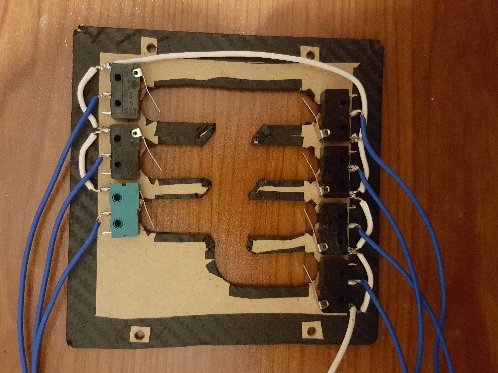

# Automobile-Simulator
School project for graduation

## Документация
https://docs.google.com/document/d/1Sk5HjTnGerCGHxoLQ2SBMM8LJcSCnkaNm4ZS78BWRqE/edit?usp=sharing

## Принципна електрическа схема

## Снимки 

