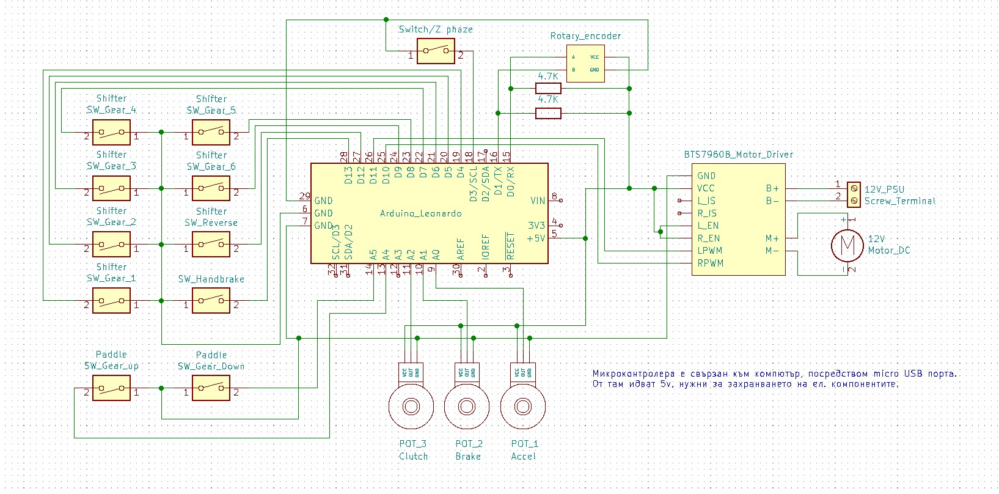
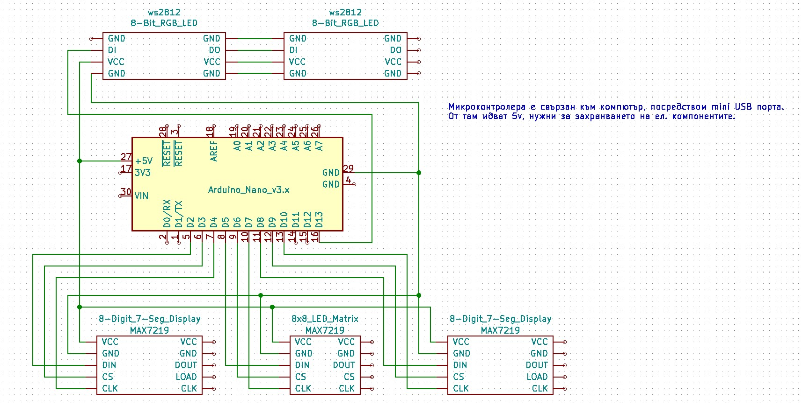

# Automobile-Simulator
School project for graduation

## Документация
https://docs.google.com/document/d/1Sk5HjTnGerCGHxoLQ2SBMM8LJcSCnkaNm4ZS78BWRqE/edit?usp=sharing

## Принципна електрическа схема на автомобилния симулатор

## Принципна електрическа схема на инструменталното табло

## Снимки 

